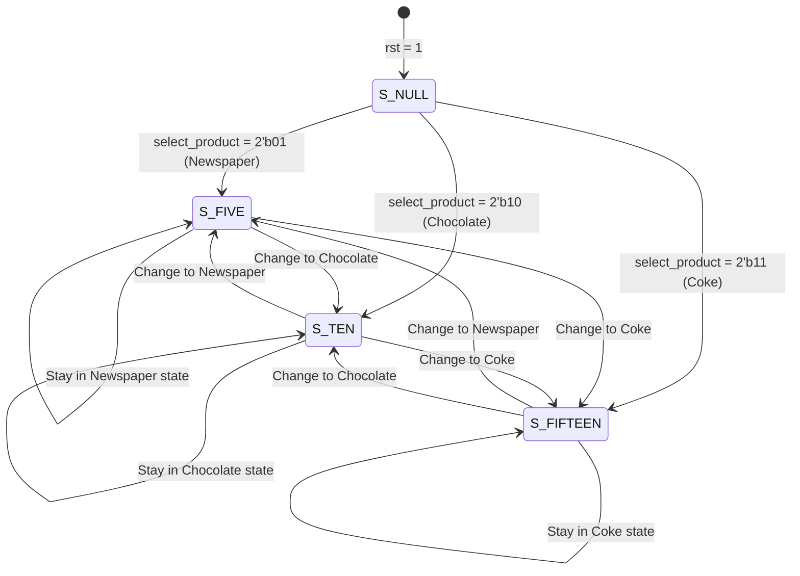

# Finite State Machine (FSM) Vending Machine

A Verilog-based Finite State Machine (FSM) simulation of a vending machine. The design accepts various currency inputs, tracks the state based on product selection, handles extra top-up money if the initial insertion is insufficient, dispenses the product, and returns the remaining change.

## Product Price List

| Product | Product Code (`select_product`) | Price |
| :--- | :--- | :--- |
| **Newspaper** | `2'b01` | Rs. 5 |
| **Chocolate** | `2'b10` | Rs. 10 |
| **Coke** | `2'b11` | Rs. 15 |

## Accepted Currency Denominations
* **Rs. 5** (`money_5`)
* **Rs. 10** (`money_10`)
* **Rs. 20** (`money_20`)

---

## State Diagram (FSM)

The FSM is structured with the following states representing the product-handling sequence:



---

## Repository File Structure

To keep the repository clean and professional, both project folders are tracked and structured as follows:

```text
VENDING MACHINE/
├── VM_FSM/                          # Vivado Project (FSM Implementation)
│   ├── VM_FSM.srcs/                 # HDL Sources & Testbenches
│   │   ├── sources_1/new/vm.v       # Main Vending Machine Design
│   │   └── sources_1/new/vm_tb.v    # Testbench for Simulation
│   ├── VM_FSM.xpr                   # Vivado Project File
│   └── vending_machine_tb_behav.wcfg # Waveform Configuration File
├── vending_machine/                 # Vivado Project (Alternative Implementation)
│   ├── vending_machine.srcs/        # HDL Sources & Testbenches
│   └── vending_machine.xpr          # Vivado Project File
├── .gitignore                       # Rules to ignore temporary Vivado files
└── README.md                        # Documentation (this file)
```

---

## Simulation Waveform

Below is the simulation verification from Vivado Simulator (`xsim`), detailing the cycle-by-cycle output:

*(Insert your simulation screenshot here)*

### How to Run:
1. Open Xilinx Vivado.
2. Select **Open Project** and choose `VM_FSM/VM_FSM.xpr`.
3. In the Flow Navigator, click **Run Simulation** -> **Run Behavioral Simulation**.
4. Use the `vending_machine_tb_behav.wcfg` to load the pre-configured waveform signals.
